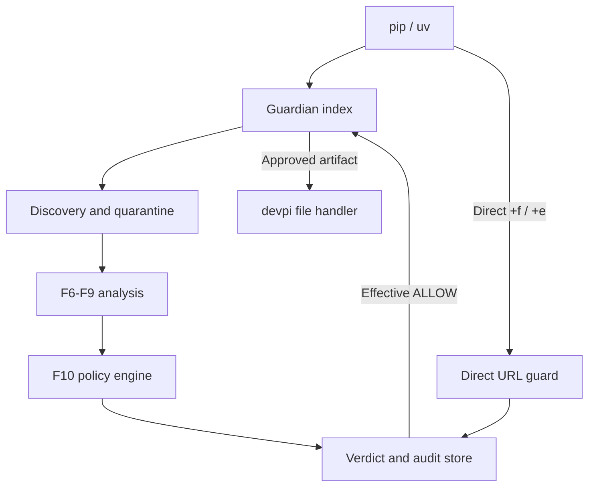

<div align="center">

# 🛡️ devpi-guardian

**Every Python package installation is a policy decision.**

*devpi-guardian is a fail-closed software supply-chain security plugin for
devpi-server. It quarantines and analyzes Python artifacts, compares new releases
with trusted baselines, and exposes only policy-approved SHA-256 identities to
pip and uv.*

**The policy-enforced Python package gateway**

[](#requirements)
[](https://github.com/devpi/devpi)
[](#project-status)
[](https://github.com/Beaver-Chain-Protect/devpi-guardian/stargazers)

[Architecture](#how-it-works) · [Security model](#security-model) · [Developer preview](#developer-preview) · [Contributing](#contributing)

</div>

> [!WARNING]
> **Early alpha.** The implementation is being integrated through stacked feature
> branches. `main` is not yet a runnable release, and APIs and configuration may
> change. Do not deploy devpi-guardian as a production security boundary yet.

## Why devpi-guardian

Traditional package scanning reports risk after a package has already become
installable. devpi-guardian moves the decision into the package-serving path:

- pip and uv keep using standard devpi and PEP 503/691 endpoints;
- unknown, scanning, review, denied, errored, or structurally invalid artifacts
  remain unavailable;
- a direct devpi `+f` or `+e` URL cannot bypass the Simple-index decision;
- new releases are evaluated against both static rules and previously approved
  releases; and
- every state-changing decision is committed with a tamper-evident audit event.

No installer plugin is required. The enforcement point is the devpi server that
already mediates package delivery.

## How it works



1. A Guardian index inherits packages from a private stage or PyPI mirror.
2. Missing artifacts are registered as metadata and processed outside the request
   thread.
3. The worker verifies SHA-256 and size before publishing bytes to a
   content-addressed quarantine.
4. Baseline comparison and non-executing analyzers produce structured evidence.
5. The immutable policy engine applies deterministic precedence:
   `DENY > REVIEW > ALLOW`.
6. The verdict and its evidence are stored by artifact SHA-256. State changes and
   audit events commit or roll back together.
7. Simple responses and direct file routes consult the same effective verdict.

## What you get

- **Fail-closed serving.** Only artifacts with a structurally valid, effective
  `ALLOW` verdict can reach the devpi file handler.
- **Standards-native enforcement.** PEP 503 HTML and PEP 691 JSON Simple responses
  retain link order and package metadata while disallowed links are removed.
- **Direct-download protection.** `GET`, `HEAD`, PEP 658 `.metadata`, `+f`, and `+e`
  release paths are checked independently of the index page.
- **Verified quarantine.** Advertised hashes and sizes are checked before analysis
  and content-addressed publication.
- **Behavioral release diffing.** New package behavior is compared with a trusted,
  previously allowed wheel or sdist.
- **Non-executing artifact analysis.** Installation surfaces and sdist/wheel
  differences are inspected without importing or executing package code.
- **Immutable policy decisions.** Secure coverage defaults, stable reason codes,
  bounded scores, explicit confidence tiers, and content-addressed policy versions.
- **Tamper-evident audit.** Append-only SQLite records form a SHA-256 hash chain
  verified at startup and on demand.
- **Audited administration.** A versioned REST API and REST-only CLI support
  inspection, approval, blocking, rescans, temporary exceptions, and health checks.
- **Cooldown enforcement.** Newly automated `ALLOW` artifacts remain hidden for a
  configurable observation window before becoming installable.

## Security decisions

Guardian uses one effective decision for both package discovery and direct download.

| Condition | Simple index | Direct release URL |
| --- | --- | --- |
| Effective `ALLOW`, cooldown expired | Link is visible | Request reaches devpi |
| Missing, `DISCOVERED`, or `SCANNING` | Hidden | Sanitized `404` |
| `REVIEW`, `DENY`, or `ERROR` | Hidden | Sanitized `404` |
| Active post-analysis cooldown | Hidden | Sanitized `404` |
| Missing or invalid artifact identity | Hidden | `503 Service Unavailable` |
| Verdict store unavailable or corrupt | `503` with `Retry-After: 5` | `503` with `Retry-After: 5` |

Manual decisions follow the same precedence rules. A current manual `DENY` wins;
a current manual `ALLOW` is next; otherwise Guardian uses the current automated
verdict. Expired overrides are ignored deterministically.

## Analysis pipeline

### Trusted baseline and behavioral diff

Guardian selects the closest lower, already allowed release in this order:

1. exact interpreter, ABI, and platform wheel tag;
2. universal wheel;
3. approved sdist; or
4. no baseline.

A missing baseline is not silently treated as safe. With secure policy defaults it
becomes an explicit coverage gap and produces `REVIEW`.

The behavioral diff identifies newly introduced credential-to-network flows, risky
Python calls, executable `.pth` files, native files, and entry points. Existing
baseline behavior is carried forward as evidence rather than misreported as new.

### Installation-surface analysis

The analyzers inspect, among other signals:

- `setup.py`, `setup.cfg`, `pyproject.toml`, and PEP 517 `backend-path`;
- executable `.pth` and customize modules;
- entry points and wheel `.data/scripts`;
- process, network, dynamic import/exec, and file-write calls;
- credential-to-network data flow;
- native and executable files;
- wheel `RECORD` integrity; and
- project identity, AST, dependency, and entry-point differences between matching
  sdists and wheels.

Archive extraction is bounded and rejects path traversal, unsafe links, excessive
member counts, oversized payloads, and suspicious compression ratios. Production
callers use isolated child-process entry points with timeouts. POSIX memory limits
are best-effort and should be reinforced with containers or cgroups where a hard
limit is required.

## Deterministic policy

The policy engine is a pure decision layer over canonical configuration and analyzer
evidence. It does not use an LLM.

```python
from devpi_guardian.policy import PolicyConfig, PolicyEngine

policy = PolicyEngine(
    PolicyConfig(
        name="release-policy",
        revision="2026-08",
        require_baseline=True,
        require_f9_pair=True,
    )
)

assessment = policy.assess(report)
verdict = policy.evaluate(target, report)
assert assessment.policy_version == policy.policy_version
```

The secure defaults require both a trusted baseline and an sdist/wheel pair. Any
effective `DENY` finding wins. Analyzer errors, coverage gaps, or `REVIEW` findings
produce `REVIEW`. Only a clean, covered report produces `ALLOW`.

Policy versions are content-addressed:

```text
<name>/<revision>+sha256:<64 lowercase hexadecimal characters>
```

Changing policy creates a new versioned verdict on rescan without rewriting prior
history.

## Tamper-evident audit

Guardian records state transitions in an append-only SQLite table protected by
update/delete prevention triggers. Each record hashes the previous record and its
own canonical semantic fields.

- audit writes use the same SQLite transaction as the protected mutation;
- startup fails if the chain cannot be verified;
- verification streams records instead of loading the entire chain into memory;
- modified, missing-middle, and reordered events are detected; and
- optional expected-head pinning detects tail deletion.

> [!IMPORTANT]
> A local hash chain is tamper-evident, not an external trust anchor. An administrator
> who can replace the database can recompute the entire chain. Pin the expected head
> in an external signed or access-controlled system when that threat is in scope.

## Guardian index

Create a read-only Guardian index over an existing devpi stage or mirror:

```console
devpi index -c root/guardian type=guardian bases=root/pypi
```

Point standard installers at its Simple endpoint:

```console
pip install --index-url https://devpi.example.com/root/guardian/+simple/ PACKAGE
uv pip install --index-url https://devpi.example.com/root/guardian/+simple/ PACKAGE
```

The index requires at least one explicit base and rejects direct uploads.

## Administrator API and CLI

The versioned API is served under `/<devpi-root>/+guardian/api/v1` and currently
defines:

| Method | Path | Purpose |
| --- | --- | --- |
| `GET` | `/quarantine` | List quarantined artifacts with filters and pagination |
| `GET` | `/artifacts/{sha256}` | Inspect one artifact and its decision history |
| `POST` | `/artifacts/{sha256}/approve` | Create a reason-bound manual approval |
| `POST` | `/artifacts/{sha256}/block` | Create a reason-bound manual denial |
| `POST` | `/artifacts/{sha256}/rescan` | Return an artifact to discovery |
| `POST` | `/artifacts/{sha256}/exceptions` | Add an expiring exception |
| `GET` | `/health` | Report database and mutation readiness |

The `guardian` CLI is only an API client; it never opens `guardian.db` directly.
Authorization, validation, state transitions, actor attribution, and auditing stay on
the server.

```console
guardian --api-url https://devpi.example --json quarantine list
guardian --api-url https://devpi.example artifact inspect <sha256>
guardian --api-url https://devpi.example artifact approve <sha256> \
  --reason "reviewed by security"
guardian --api-url https://devpi.example exception add <sha256> \
  --expires-at 2026-08-25T00:00:00+00:00 \
  --reason "temporary release"
```

Mutation endpoints remain unavailable until the transactional audit writer is ready.
Read-only inspection can remain available while health reports
`mutations_ready: false`.

## Requirements

- Python 3.11 or newer
- devpi-server 6.20.3
- SQLite with WAL support
- persistent storage for `guardian.db`, its WAL files, and quarantine artifacts
- pip or uv clients using the Guardian index

devpi-guardian itself does not require a hosted control plane. Deployments still need
normal network controls if clients must be prevented from bypassing devpi and reaching
public package indexes directly.

## Developer preview

The current F10/F12 and F11 integration branch can be inspected from source:

```console
git clone https://github.com/Beaver-Chain-Protect/devpi-guardian.git
cd devpi-guardian
git switch feature/openbv-2-f11-admin-api-cli
uv sync --extra test
uv run pytest -m "not integration" -q
```

Run the plugin with an explicit persistent database path:

```console
uv run devpi-server --guardian-db /var/lib/devpi-guardian/guardian.db
```

If `--guardian-db` is omitted, Guardian uses
`<devpi-server-path>/guardian/guardian.db`. The first initialization of an empty
database must have exactly one migration owner. Keep the database and WAL files on a
persistent volume.

> [!NOTE]
> The production F5 worker lifecycle and final stacked-branch integration are still in
> progress. The preview branch is for review and testing, not deployment.

## Component map

| Feature | Responsibility |
| --- | --- |
| F1 | Read-only Guardian devpi index |
| F2 | PEP 503/691 Simple-link filtering |
| F3 | Direct `+f`/`+e` release enforcement |
| F4 | SHA-256 verdict, evidence, and transition store |
| F5 | Discovery, verified quarantine, worker orchestration, and cooldown |
| F6 | Trusted baseline selection |
| F7 | Behavioral security diff and confidence tiering |
| F8 | Installation-surface analysis |
| F9 | Matching sdist/wheel analysis and coverage reporting |
| F10 | Immutable deterministic policy engine |
| F11 | Administrator REST API and CLI |
| F12 | Transaction-bound append-only audit chain |

Current implementation and integration work is tracked in
[pull requests](https://github.com/Beaver-Chain-Protect/devpi-guardian/pulls).

## Security model

devpi-guardian is designed around these invariants:

- canonical lowercase SHA-256 is the artifact identity;
- structural validation and bounded canonical inputs fail closed;
- missing identity never falls back to a filename, URL fragment, or client header;
- Simple filtering and direct downloads use the same verdict reader;
- only an effective `ALLOW` can pass enforcement;
- F7 confidence tiers and F9 coverage gaps remain explicit policy inputs;
- policy precedence is deterministic and independent of evidence order;
- verdict and evidence history is immutable;
- administrative mutations require a nonblank actor and reason;
- each state mutation and its audit event share one transaction; and
- startup does not become ready with an invalid migration or audit chain.

### Non-goals and limitations

- Analyzer findings are evidence, not proof that a package is safe.
- Guardian does not dynamically execute untrusted packages or reverse engineer native
  binaries.
- Guardian does not stop a client from using another index; enforce index and egress
  policy separately.
- SQLite and a local hash chain do not defend against an administrator who can replace
  the database and every external anchor.
- Multi-writer and horizontally scaled production topology is not part of the current
  alpha deployment model.

Please report suspected vulnerabilities privately through the repository's
[Security tab](https://github.com/Beaver-Chain-Protect/devpi-guardian/security).

## Development

```console
uv sync --extra test
uv run pytest -m "not integration" -q
uv run pytest -m integration -q
uv run ruff format --check .
uv run ruff check .
uv run flake8 src tests
uv lock --check
uv build
```

The test suite covers verdict invariants, policy precedence, analyzer contracts,
archive limits, audit-chain verification, pip/uv behavior, devpi restarts,
concurrency, direct URLs, and fail-closed identity and storage failures.

## Project status

The project is implementing a complete F1-F12 pipeline through stacked pull requests.
The principal remaining integration work is:

- final worker startup and lifecycle wiring;
- runtime configuration for quarantine, worker limits, polling, and cooldown;
- a live end-to-end path from Simple discovery through analysis and cooldown to
  pip/uv installation;
- richer worker, queue, and devpi health data; and
- the remaining administrator commands for policy simulation, baselines, audit
  listing, and artifact diffs.

See the active [pull requests](https://github.com/Beaver-Chain-Protect/devpi-guardian/pulls)
for current branch dependencies and validation evidence.

## Contributing

Issues, security review, test cases, analyzer rules, policy design, and devpi
integration feedback are welcome.

Before opening a pull request:

1. confirm the correct base branch because feature work may be stacked;
2. add tests for new security behavior and failure paths;
3. keep analyzer output deterministic and bounded;
4. run the development checks above; and
5. document any trust-boundary or fail-open impact explicitly.

Use [GitHub Issues](https://github.com/Beaver-Chain-Protect/devpi-guardian/issues) for
bugs and proposals, and review the existing
[pull requests](https://github.com/Beaver-Chain-Protect/devpi-guardian/pulls) before
starting overlapping work.

## Maintainers

devpi-guardian is maintained by the Beaver Chain Protect project maintainers and
contributors.

If this project helps you build a safer Python package supply chain, consider starring
the repository so other security and platform engineers can find it.
